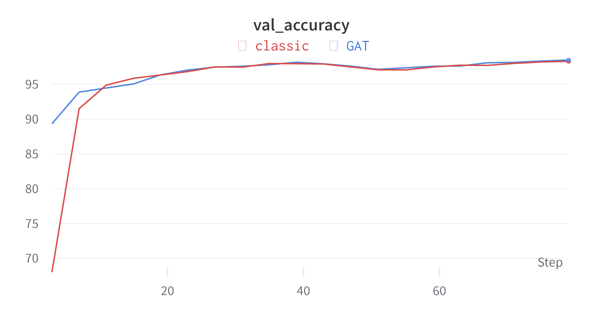

# graph-transformer-psiml
Transformer implemented with graph neural network attention layer from Pytorch Geometric. This was a project for [PSIML](https://psiml.petlja.org/), Practical Seminar for Machine Learning organized by PFE, Petlja, Everseen, and Microsoft in Belgrade 2022.

  

## Authors

- Marina Debogović (ETF)
- Marko Njegomir (FTN)

## Mentors
- Anđela Donević (Everseen)
- Nikola Popović (ETH Zurich)

  
  
Illustration 1 - Transformer with graph attention network (DALLE-2).

# Architecture

- The attention layer in ViT Encoder is replaced with GATv2 (Graph Attention network).
  - Inputs for the GATv2 must be a single graph and an adjacency list.
      - To support batches, a disjoint union of graphs in the batch is created, so we get a single graph.
  - Output dim from the GATv2 is multiplied by the number of heads
      - A new layer is added that reduces the output dim to the input dimensions so the layers can be stacked.
- GATv2 layers can easily be replaced with any other GNN layer in Pytorch Geometric.
  - For some specific layers that take more than just vertices and edges some tweaks to the inputs and outputs might be necessary.

  
  
Illustration 2 - Attention layer in Vision Transformer's Encoder is replaced with Graph Attention Network.

# Results

- Trained and tested on VM with a single V100 GPU
- Due to time and hardware constraints, models were compared on MNIST and CIFAR10
- There were no pre-trained models on Imagenet with this architecture available, so no transfer learning was possible.
  - Training the model on Imagenet first and then finetuning to some other specific task might improve performance.

## MNIST

  
  
Illustration 3 - MNIST train loss for Classic ViT and our Graph Transformer.

  
  
Illustration 4 - MNIST train accuracy for Classic ViT and our Graph Transformer.

  
  
Illustration 5 - MNIST validation accuracy for Classic ViT and our Graph Transformer.

## CIFAR10

  
  
Illustration 6 - CIFAR10 train loss for Classic ViT and our Graph Transformer.

  
  
Illustration 7 - CIFAR10 train accuracy for Classic ViT and our Graph Transformer.

  
  
Illustration 8 - CIFAR10 validation accuracy for Classic ViT and our Graph Transformer.

